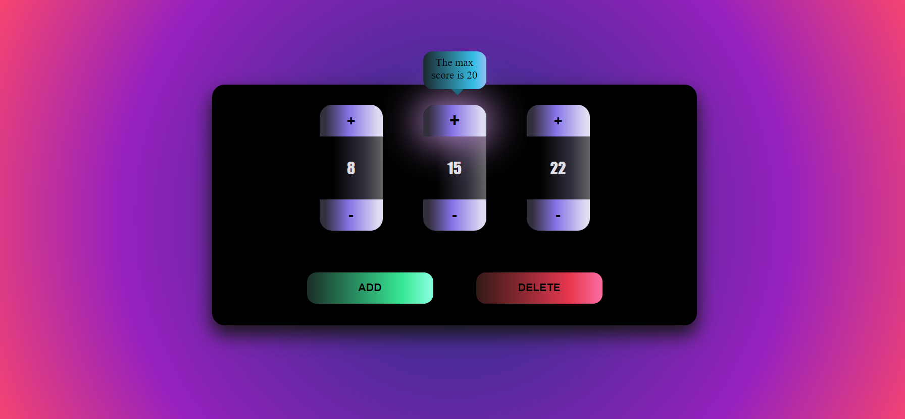

# Card counter - Daniela Serrano

This is a practice exercise that helps to understand the JSON file flow using CRUD. 

## Table of contents

- [Overview](#overview)
  - [The exercise](#the-exercise)
  - [Screenshot](#screenshot)
  - [Links](#links)
- [My process](#my-process)
  - [Built with](#built-with)
  - [What I learned](#what-i-learned)
- [Author](#author)

## Overview

### The exercise

Users should be able to:

- Add maximun 5 cards
- Delete the cards until reminds just one
- Modificate the score number with a condition: If the card is in the first position, the counter is going to count until the position multiplicated by 10, it means that the counter is plusing until 10. Else if the card is in the second position, it means that the score is counting until 20 because it mutiplies the position (2) by 10. In that way, the third position the score is until 30 (position 3 per 10), the fourth until 40 and the fifth until 50 

### Screenshot



### Links

- Exercise URL: [Exersice](https://github.com/danielaser/card-counter)
- Live Site URL: [Card counter](https://your-live-site-url.com)

## My process

### Built with

- Semantic HTML5 markup
- CSS custom properties
- Flexbox
- Responsive style
- Vanilla Javascript

### What I learned

This exersice helps to understand the JSON file flow throw the application

To see how you can add code snippets, see below:

```js
function showCard() {
    fetch('./JSONDATA.json')
        .then(response => response.json())
        .then(data => {
        });
}
```

## Author

- Website - [Daniela Serrano](https://danielaser.github.io/)
- Github - [@danielaser](https://github.com/danielaser)

